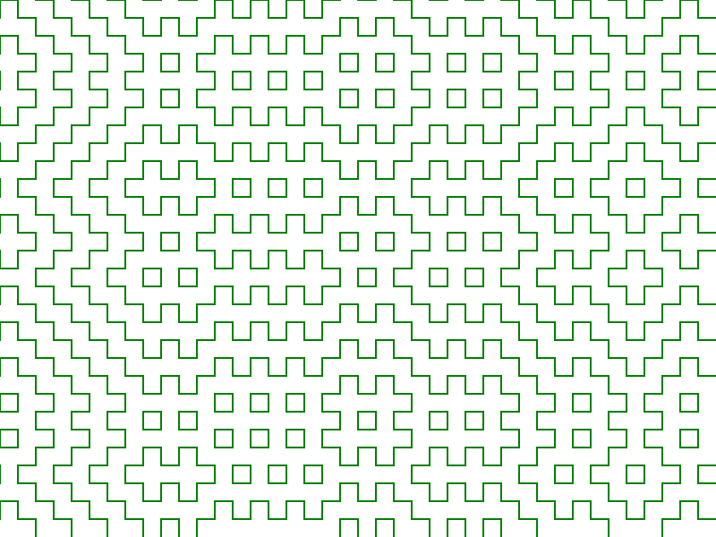

# Hitomezashi Pattern Renderer

A simple JavaFX application for drawing Hitomezashi stitch patterns.

To learn about Hitomezashi patterns, watch this [Numberphile Video](https://youtu.be/JbfhzlMk2eY?si=AVzGKizFhZOK0Jwj).

To build an installable package for Windows, clone this repo and run:

&nbsp;&nbsp;&nbsp;&nbsp;`./gradlew jpackage`

Or run the `Package for Release` run configuration in IntelliJ IDEA.
